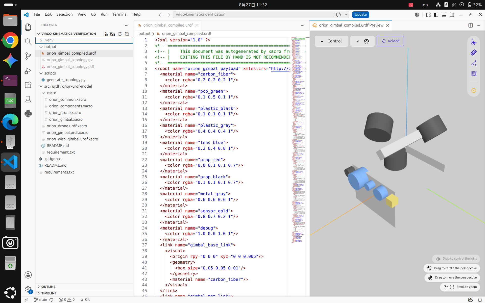
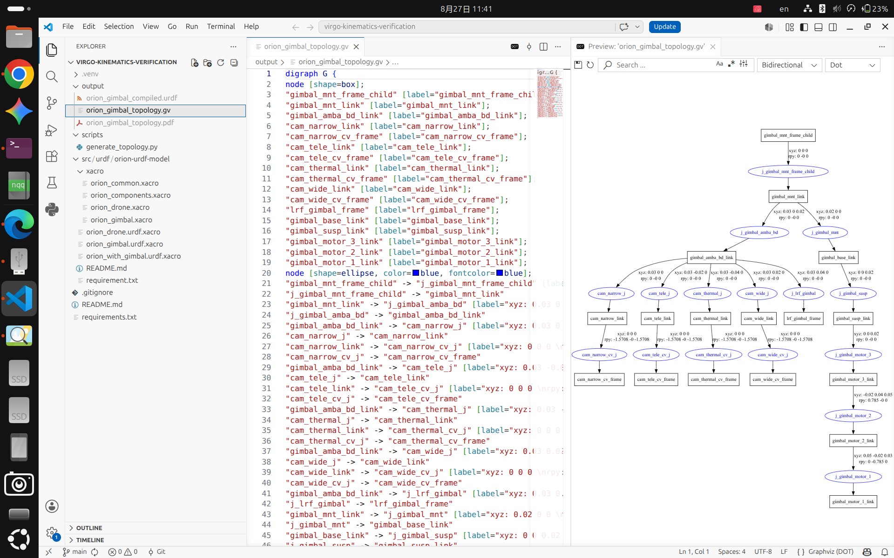
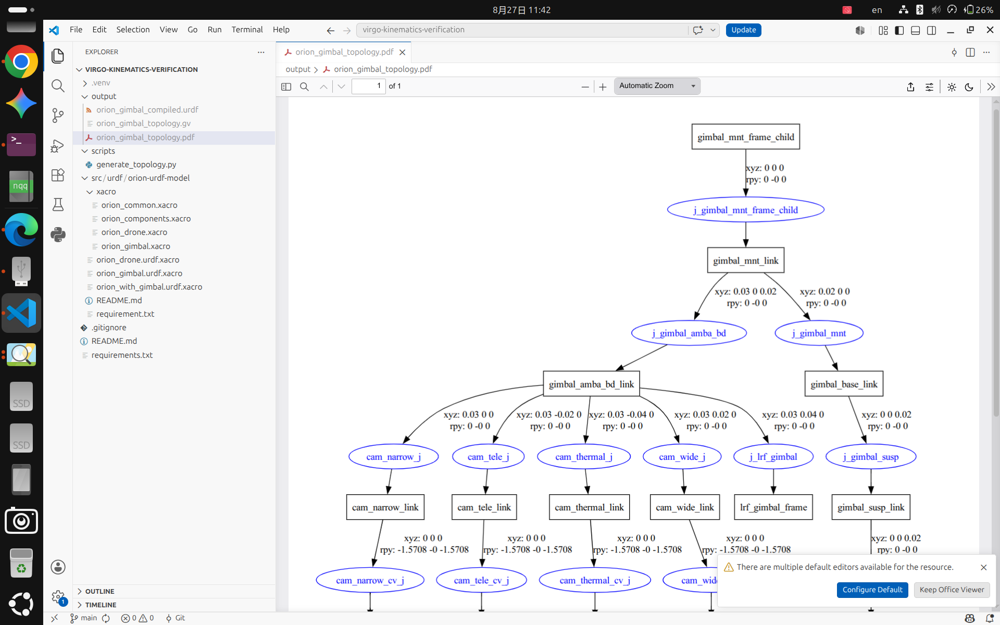

# Virgo Gimbal Kinematics & Topology Verification Pipeline

This repository hosts the kinematics architecture, URDF/Xacro models, and TF tree topology verification pipeline for the **Virgo Gimbal System**.

The entire compilation and rendering workflow is powered by the **ROS 2 native robotics toolchain**, ensuring strict coordinate frame integrity and structural compliance.

---

## 1. Modular Extraction Architecture

The source model package contains both the host drone and the gimbal payload. To isolate and verify **only the Gimbal subsystem** without instantiating the entire UAV assembly:

- **Target Entrypoint**: `src/urdf/orion-urdf-model/orion_gimbal.urdf.xacro`
- **Mechanism**: Instead of evaluating `orion_with_gimbal.urdf.xacro` (which binds the drone body to the payload mount), we directly instantiate the `orion_gimbal` macro defined in `xacro/orion_gimbal.xacro`.
- **Root Frame**: The top attachment frame `gimbal_mnt_frame_child` serves as the root link, isolating the suspension (`gimbal_susp_link`), 3-axis motor chain (`motor_3` -> `motor_2` -> `motor_1`), and Ambarella sensor carrier payload (`gimbal_amba_bd_link`).

---

## 2. ROS 2 Toolchain Conversion Pipeline

The automated verification pipeline follows a 3-stage deterministic process:

1. **`xacro` (ROS 2 Core)**: Compiles parameter definitions, evaluates mathematical transforms, and resolves link/joint inheritance into a unified standard URDF XML.
2. **`urdf_to_graphviz` (`liburdfdom-tools`)**: Parses the kinematics tree DOM, validating parent-child joint constraints, joint types (fixed, continuous), and origin transforms `(xyz, rpy)`.
3. **`graphviz` (DOT Engine)**: Renders the topological graph into `.gv` and vector `.pdf` artifacts.

---

## 3. Verification Artifacts & Visual Proof

### A. Compiled URDF & 3D Kinematic Visual Preview
Verified 3D mesh placement, coordinate alignments, and link geometries rendered directly in VS Code from `orion_gimbal_compiled.urdf`.

---

### B. Graphviz DOT Topological Source Code
Structural graph descriptor (`orion_gimbal_topology.gv`) extracted via `urdf_to_graphviz`.

---

### C. Generated Kinematic TF Tree Topology (PDF)
Vector tree topology representing the full transformation matrix chain from `gimbal_mnt_frame_child` down to optical sensor frames (`cam_wide`, `cam_narrow`, `cam_tele`, `cam_thermal`).

---

## 4. Quick Start & Reproduction

1. Activate virtual environment: `source .venv/bin/activate`
2. Install dependencies: `pip install -r requirements.txt`
3. Execute automated pipeline: `python3 scripts/generate_topology.py src/urdf/orion-urdf-model/orion_gimbal.urdf.xacro output`
