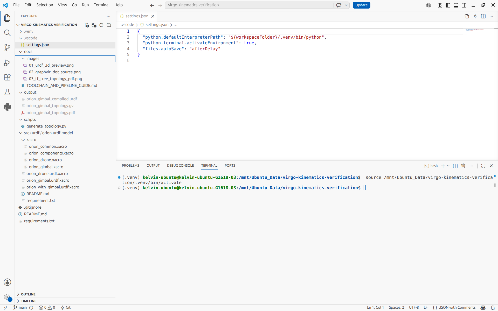

# ROS 2 Toolchain Installation & Pipeline Architecture Guide

This document details the toolchain, installation, verification steps, and dependency design rationale for the **Virgo Gimbal Kinematics Verification System**.

## 1. Toolchain Overview & Roles
- **xacro**: Evaluates XML macros, math parameters, and imports into a single unified URDF.
- **liburdfdom-tools (urdf_to_graphviz)**: Parses URDF links/joints hierarchy into DOT graph format (.gv).
- **graphviz (dot engine)**: Renders DOT descriptor into vector PDF tree and PNG diagrams.
- **generate_topology.py**: Python orchestrator combining xacro and urdf_to_graphviz in a single command.
- **render_joint_graph.py**: Custom Python script utilizing standard libraries to generate styled Graphviz kinematic joint structure diagrams (`*_joint_graph.gv` and `*_joint_graph.png`) with color-coded root links, standard links, fixed joints, and revolute/continuous joints.

## 2. Dependency Architecture & requirements.txt Design
In this workspace, `requirements.txt` intentionally contains only `xacro>=2.0.0` due to core architectural principles:
- **Python-Level Single Dependency**: In the Python virtual environment, the automation script only requires `xacro` for evaluating XML macros and calculating geometric formulas.
- **System-Level Native Binaries (APT)**: Core robotics libraries such as `liburdfdom-tools` (C++ DOM parser) and `graphviz` (C-based vector rendering engine) are native OS binaries managed by `apt`, not Python packages.
- **Lightweight & Decoupled Design**: Separating system tools (`apt`) from Python runtimes (`pip`) prevents virtual environment bloat and maintains cross-platform portability.

## 3. Installation Procedures
1. System utilities: `sudo apt update && sudo apt install -y liburdfdom-tools graphviz python3-pip python3-venv`
2. Virtual environment: `python3 -m venv .venv && source .venv/bin/activate`
3. Python dependencies: `pip install -r requirements.txt`

## 4. IDE Integration (VS Code Workspace)
The repository includes `.vscode/settings.json` to streamline the development workflow:
- **Automatic Virtual Environment Binding**: Configured `python.defaultInterpreterPath` points directly to `${workspaceFolder}/.venv/bin/python`.
- **Auto Environment Activation**: Terminal instances opened within VS Code automatically activate `.venv`.
- **File Auto-Save**: Enabled `files.autoSave` with short delay to maintain synchronization.



## 5. Toolchain Verification Checklist
- Verify parser CLI: `urdf_to_graphviz 2>&1 | head -n 2`
- Verify Graphviz engine: `dot -V`
- Verify Python Xacro: `python3 -c "import xacro; print(xacro.__file__)"`

## 6. Execution Workflow
1. Execute automated TF tree topology pipeline:
```bash
python3 scripts/generate_topology.py src/urdf/orion-urdf-model/orion_gimbal.urdf.xacro output
```

2. Render custom kinematic joint structure graph:
```bash
python3 scripts/render_joint_graph.py src/urdf/orion-urdf-model/orion_gimbal.urdf.xacro output
```

